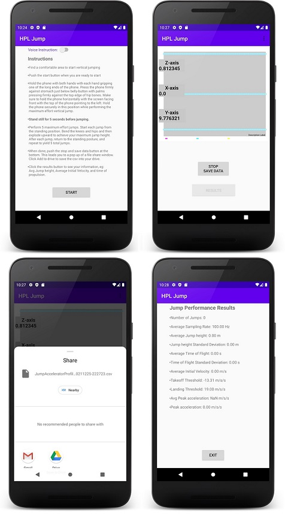

# HPL Jump High

This is a research app to use the accelerometer to measure jump characteristics ( height, velocity, time of propulsion, and peak acceleration) in order to detect patterns to predict premature injuries using machine learning techniques.

This is currently the first version, I am still working to add more features like time of propulsion and saving the data in the app. 

<p align="center">
    
</p>


## Features
1. Track your daily jump routines 
2. Detect user's jump patterns
3. Detect early signs of injury (work in progress) 
4. Work with any android phone with accelerometer
5. Working with any sample rate of accelerometer.
6. Jump streak count to motivate users' exercise. (in progress)
7. Measure and calculate user's average and standard deviation of jump height, jumpcount, initial velocity, TFlight, peak acceleration, time of propulsion and others! 
8. Tolerates users phone holding position inaccuracies.

### Setup development environment

* [Android Studio](https://developer.android.com/studio)

* [Android SDK Tools](https://developer.android.com/studio#Other)


### Build & Run the application

1. Get the source code.

```
git clone --recursive https://github.com/vivianzhu2/hpl_jumphigh.git
```
2. Export `ANDROID_HOME` variable or create a symbolic link at `${HOME}/android-sdk` to point your Android SDK installation path.

```
export ANDROID_HOME=/path/to/sdk
```
```
ln -s /path/to/sdk ${HOME}/android-sdk
```

3. Export `JAVA_HOME` variable or create a symbolic link at `${HOME}/android-java` to point your Java installation path.

```
export JAVA_HOME=/path/to/jdk
```
```
ln -s /path/to/jdk ${HOME}/android-java
```
4. Open the project with Android Studio, let it build the project and hit Run.

### APK Download
If you want to try the app without building it, you can directly download it from: 

## Libraries

The libraries and tools used include:

- Support library
- [MikePhil.charting](import com.github.mikephil.charting.charts.LineChart)

## Requirements

- [Android SDK](http://developer.android.com/sdk/index.html).
- Android [6.0 (API 23) ](http://developer.android.com/tools/revisions/platforms.html#6.0).
- Android SDK Tools
- Android SDK Build tools 23.0.1
- Android Support Repository

## Build Instructions

In order to run this project, you'll need to setup several things beforehand:


## Todo
1. Feasibility of having the app available on both Android and iPhone phones.
2. Feasibility of making it available to anyone to download (free vs small fee).
3. Feasibility of having the App keep track of a user’s jump metrics and graph results from multiple sessions.


## Credits
The HPL Jump app is an internal project based off of our [Android Boilerplate](https://github.com/ribot/android-boilerplate).

