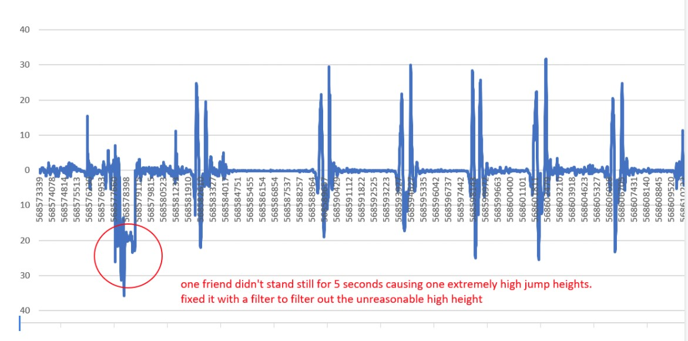

# HPL Jump High

This is a research app to use the android phone accelerometer to measure jump characteristics ( height, velocity, time of propulsion, and peak acceleration) in order to detect patterns to predict premature injuries using machine learning techniques.

This is currently the first version. I am still working to add more features like time of propulsion and saving the data in the app. 

<p align="center">
    
</p>


## Features
1. Track your daily jump routines 
2. Detect user's jump patterns
3. Detect early signs of injury (work in progress) 
4. Work with any android phone with accelerometer
5. Working with any sample rate of accelerometer.
6. Jump streak count to motivate users' exercise. (in progress)
7. Measure and calculate user's average and standard deviation of jump height, jumpcount, initial velocity, TFlight, peak acceleration, time of propulsion and others! 
8. Tolerates users phone holding position inaccuracies.

## Download

APK is available to download here: https://github.com/vivianzhu2/hpl_jumphigh/blob/master/app/build/outputs/apk/debug/app-debug.apk
Welcome to try the app to find out how high you can jump. Let me know if there is an issue using the Github issue reporing menu above. 
Happy Jumping! 

### Setup development environment

* [Android Studio](https://developer.android.com/studio)

* [Android SDK Tools](https://developer.android.com/studio#Other)


## User Instructions
User manual can be downloaded at: https://github.com/vivianzhu2/hpl_jumphigh/blob/master/app/images/hpl%20jump%20instruction%20manual.docx
<p align="center">
    
</p> 


### Build & Run the application

1. Get the source code.

```
git clone --recursive https://github.com/vivianzhu2/hpl_jumphigh.git
```
2. Export `ANDROID_HOME` variable or create a symbolic link at `${HOME}/android-sdk` to point your Android SDK installation path.

```
export ANDROID_HOME=/path/to/sdk
```
```
ln -s /path/to/sdk ${HOME}/android-sdk
```

3. Export `JAVA_HOME` variable or create a symbolic link at `${HOME}/android-java` to point your Java installation path.

```
export JAVA_HOME=/path/to/jdk
```
```
ln -s /path/to/jdk ${HOME}/android-java
```
4. Open the project with Android Studio, let it build the project and hit Run.


## Libraries

The libraries and tools used include:

- Support library
- [MikePhil.charting](import com.github.mikephil.charting.charts.LineChart)

## Requirements

- [Android SDK](http://developer.android.com/sdk/index.html).
- Android [6.0 (API 23) ](http://developer.android.com/tools/revisions/platforms.html#6.0).
- Android SDK Tools
- Android SDK Build tools 23.0.1
- Android Support Repository


## Todo
1. Feasibility of having the app available on both Android and iPhone phones.
2. Feasibility of making it available to anyone to download (free vs small fee).
3. Feasibility of having the App keep track of a user’s jump metrics and graph results from multiple sessions.


### The process of creating the app: 
1. Started with the Zaccelerometer App found on Github, to install and learn more about accelerometer. 
2. Create multiple pages - beginning page, capture, and save pages.
3. Analyze acceleration graphs to determine jump beginnings and endings.
4. Determine TFlight, sampling rate, jump height
5. Make same for all sampling rates, adjusting thresholds of 
6. Determine Peak acceleration 


After some experimenting, the resultant acceleration worked better than just the X- acceleration.

<p align="center">
    
</p> 


#### Calculating Sample Rate:
sampling rate = number of samples/second Hz
Average sampling rate is around 120 Hz for 84 seconds on my phone. Each sample includes all 3 axis data. To do this, I counted the total number of samples on spreadsheet
and found the total time duration and divided them.


#### Calculating TFlight
When the acceleration is 9.81 m/s/s, the person is in the air. The acceleration should be changing before the person leaves the ground and after the person contacts the ground again. During the time between these two points is the time of flight also known as TFlight.
The acceleration during flight should be 9.81 m/s/s different than the acceleration during quiet standing.
Vi =  (9.81 m/s/s)*(Tflight/2) = 1.91m/s
Height = (Vi*Tflight/2)-(1/2)*(9.81 m/s/s)*((Tflight/2)*(Tflight/2)) = 0.18m

Reference:
https://www.researchgate.net/publication/221334626_Standing_Jump_Loft_Time_Measurement_-_An_Acceleration_based_Method

<p align="center">
    
</p> 


#### Calculating Peak Acceleration

<p align="center">
    
</p> 


## Contributors:
Vivian Zhu 

Professor David Hawkins


## Credits
The HPL Jump app referenced the accelerometer capture example [ZAccelerometer](https://github.com/zkhan1/ZAccelerometer-Android-app).

Special thanks to Professor David Hawkins from UC Davis Human Performance Lab for guiding me through this project! 


### Issues Fixed


 
#### #1
 
<p align="center">
    
</p> 

 
#### #2
<p align="center">
    
</p> 


#### #3
<p align="center">
    
</p> 


#### #4
<p align="center">
    
</p> 


#### #5
<p align="center">
    
</p> 

 
 
